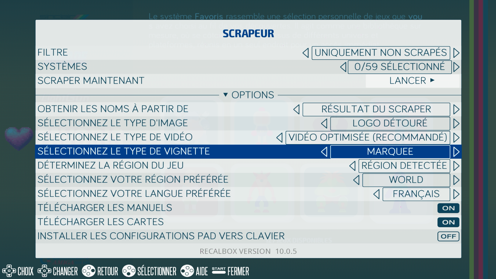

# 🎮 RetroBoxLED

**ESP32** firmware for **Recalbox** LED marquee (HUB75/DMD 128x32 P4 panels).

✅ Compatible with Recalbox 10.0.5

---

🌐 [English](README.md) | [Français](README.fr.md) | [Español](README.es.md)

---

## ℹ️ Info

I have previously built management applications in C++, C# and VB .Net for personal and professional projects.
But I have to admit that AI helped me a lot to build this in just a few days.
Obviously it is not perfect. Some large lists like ARCADE, MAME or FBNEO take a long time to display an image. That is why I am keeping this project open to everyone, waiting for someone to do better.

## ✨ Features

- **GIF playback** : Plays GIFs and PNGs (`/Arcade`, `/BEST_OF_TOP_30`, `/Pixel_Art`, etc.)
- **Fallback** : `/systems/_defaults/_default.png`
- **Playlists** : `Arcade.txt`, `Favorites.txt`, `Consoles.txt`
- **MQTT** : EmulationStation events (`rungame`, `shutdown`, etc.)
- **Recalbox** : Automatic Arcade mode

## ⭐ How it works

By default, the ESP32 plays a GIF playlist.
Once it receives information via MQTT, it automatically switches to ARCADE mode.
When Recalbox is turned off, the ESP32 resumes playlist playback.
If a GIF or PNG is missing, it will use the fallback file placed in `/systems/_defaults`.

## 📁 SD Card Structure

The SD card must be formatted as FAT32 with the following structure.
Copy the `_defaults` folder into the `systems` directory on your SD card.

```
RetroBoxLED SD Card/
├── gifs/
│   ├── Arcade/, BEST_OF_TOP_30/, Pixel_Art/   | GIFs
├── systems/
│   ├── mame/, neogeo/, snes/                  | Systems
│   │   ├── logo_detoure/, marquee             | Image folders
│   ├── _defaults/                             | Fallback files
├── playlists/
│   ├── Arcade.txt, Favorites.txt, Consoles.txt
```

## 🚀 Installation

Before use, follow these steps in order:

1. **Configuration** : Set up the `config.ini` file
2. **Playlists** : Create your playlists
3. **Tools** : Use the provided scripts
4. **Flash** : Flash the ESP32 firmware
5. **MQTT** : Understand how MQTT works
6. **Telnet** : Telnet terminal for testing

---

## 1 - ⚙️ Configuration

The `config.ini` file must be located at the root of the SD card.
It allows you to configure the following settings:

```ini
# Info
info=0                      # 0 = no info at boot, 1 = display info at boot

# Playlist
playlist=TODO.txt           # Plays the playlist specified in /playlist
random=1                    # 0 = play in order, 1 = play randomly

# Wi-Fi & Bluetooth
wifi_enabled=1              # 0 = Wi-Fi disabled, 1 = Wi-Fi enabled (keep at 1)
wifi_ssid=mywifi            # Your Wi-Fi network name
wifi_password=mypassword    # Your Wi-Fi password
bluetooth_enabled=0         # 0 = Bluetooth disabled, 1 = Bluetooth enabled (keep at 0)
                            # Enable if you experience interference (e.g. 8Bitdo Pro 3 controller)
bluetooth_name=ESP32-GIF    # Bluetooth name

wifi_static_enabled=1       # 0 = DHCP, 1 = static IP (recommended)
wifi_static_ip=192.168.20.240   # Only if wifi_static_enabled=1
wifi_gateway=192.168.20.1       # Only if wifi_static_enabled=1
wifi_subnet=255.255.255.0       # Only if wifi_static_enabled=1
wifi_dns1=1.1.1.1               # Only if wifi_static_enabled=1
wifi_dns2=8.8.8.8               # Only if wifi_static_enabled=1

# MQTT
recalbox_ip=192.168.20.104  # Fixed IP address of your Recalbox
image_folder=logo_detoure   # Either: logo_detoure or marquee
```

---

## 2 - ▶️ Playlists

You can create your own playlists.
The tool **Generador de Playlists v1.0.1.bat** (modified from [RetroPixelLED](https://github.com/fjgordillo86/RetroPixelLED)) is located in the **tools** folder of this repository.
It lists all folders found in the **gifs** directory.
If you have folders like `Arcade`, `BEST_OF_TOP_30`, `Pixel_Art`, etc. containing GIFs, you can select which ones to include in your playlist (e.g. folders 1, 3 and 5).
To include everything in a single playlist, enter `TODO`.

---

## 3 - 🛠️ Tools

A script is available for you:

**`RetroBoxLED_toolkit.py`**
- Extracts images from your media folders
- Converts images to 128x32 format
- Creates the system and game cache
- Copies everything to the SD card

The best approach is to place this file in a dedicated folder to keep everything at hand.
Simply follow the on-screen instructions and choose the desired options.

The best option for the panel is to perform a full scrape with Recalbox using the **LOGO DETOURED** or **MARQUEE** image type, which are ideal for the LED panel, as shown in the screenshot below.



Once the script is done, you will find an `sd_card` folder. Copy its contents to your SD card or keep it as a backup.

You can download system PNGs from the script or use your own.
A system named **`_defaults`** is also included. If you place a `_default.gif` or `_default.png` file there, it will be used as the default when no system image is found, and also at boot.
By default, GIFs take priority over PNGs.

---

## 4 - ⚡ Flash

Before you begin, make sure your PC recognises your ESP32.

## 💡 ESP32 not detected?

**If "Install" cannot find the COM port**:

| USB Chip | Drivers |
|----------|---------|
| **CP2102** | [Silicon Labs](https://www.silabs.com/developers/usb-to-uart-bridge-vcp-drivers) |
| **CH340/CH341** | [SparkFun](https://learn.sparkfun.com/tutorials/how-to-install-ch340-drivers/all) |

### **[👉 Install from the RETRO PIXEL LED web page](https://jamyz.github.io/RetroBoxLED/)**

Installation steps:

1. Use a compatible browser (Google Chrome or Microsoft Edge).
2. Connect your ESP32 to the USB port of your computer.
3. Click the "Install" button and select the corresponding COM port.
4. **Important:** Check the "Erase device" box to perform a full memory wipe and avoid fragmentation errors.

---

## 5 - 🧠 MQTT — The brain of RetroBoxLED

MQTT tells the ESP32 what to display.

**Recalbox → "Launching MAME" → MQTT → ESP32 → "Display MAME GIF or PNG!"**

- **Synchronisation** : The LED panel displays exactly the game being played
- **Local network** : 192.168.XXX.XXX (arcade Wi-Fi)

Example:
```
1. You launch King of Fighters (mame/kof98)
2. The marquee[rungame,...](permanent).sh script detects the event → sends "mame/kof98" via MQTT
3. ESP32 receives it → displays /systems/mame/kof98.gif
4. GIF not found? → displays /systems/_defaults/_default.gif
```

The file `marquee[rungame,endgame,systembrowsing,gamelistbrowsing,sleep,wakeup,stop,start](permanent).sh`
must be placed in `/recalbox/share/userscripts/` on your Recalbox.

---

## 6 - >_ Telnet

The firmware includes a Telnet terminal for testing the ESP32.
Type `help` to display the list of available commands.
You can send commands to change the displayed GIFs, etc.
This feature will be removed later once the code is stable, to free up space on the ESP32.

---

## 📚 Required Libraries

To compile the project from the Arduino IDE, install the following libraries via the Library Manager or from their official repositories:

- **[ESP32-HUB75-MatrixPanel-I2S-DMA](https://github.com/mrfaptastic/ESP32-HUB75-MatrixPanel-I2S-DMA)** : High-performance LED panel control via DMA.
- **[AnimatedGIF](https://github.com/bitbank2/AnimatedGIF)** : Efficient decoder for reading GIF files from the SD card.
- **[pngle](https://github.com/kikuchan/pngle)** : Reading PNG files with alpha channel from the SD card.
- **[WiFiManager](https://github.com/tzapu/WiFiManager)** : Wi-Fi connection management via a captive portal.
- **[Adafruit GFX Library](https://github.com/adafruit/Adafruit-GFX-Library)** : Base library for displaying text and geometric shapes.
- **[ArduinoJson](https://github.com/bblanchon/ArduinoJson)** : Configuration file management and web communication.

---

## 🛒 Bill of Materials

To ensure compatibility, using the components tested during development is recommended:

- **Microcontroller** : [ESP32 DevKit V1 (38 pins)](https://es.aliexpress.com/item/1005005704190069.html)
- **LED Matrix Panel (HUB75)** : [RGB Panel P2.5 / P4](https://es.aliexpress.com/item/1005007439017560.html)
- **Card reader** : [Micro SD adapter module (SPI)](https://es.aliexpress.com/item/1005005591145849.html)
- **ESP32-Panel connection board** : [DMDos Board V3 - Mortaca](https://www.mortaca.com/) *(Optional: no soldering + built-in SD reader)*
- **Power supply** : 5V source (minimum 4A recommended for 64x32 panels)

---

## 🤝 Credits

- [Original RetroPixelLED](https://github.com/fjgordillo86/RetroPixelLED)
- [Recalbox community](https://www.recalbox.com/fr/)
- [System logos released under Creative Commons CC BY-NC-ND 4.0](https://creativecommons.org/licenses/by-nc-nd/4.0/)
- [Bounitos](https://github.com/BenoitBounar)
- 🎮 [Discord Jamyz](https://discord.com/users/.jamyz)

---

## ☠️ Fallen in battle

- An old 1GB SD card used for testing
- 1 ESP32
- 1 64x32 LED panel

---

## ☕ Support the project

If this project helped you, you can buy me a coffee:

👉 [☕ Donate via PayPal](https://www.paypal.com/paypalme/jamyz77)

---

**RetroBoxLED** = Recalbox + Pixel LED perfection! 😎
